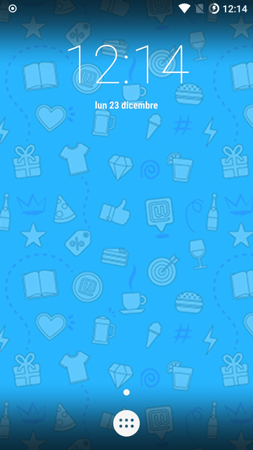
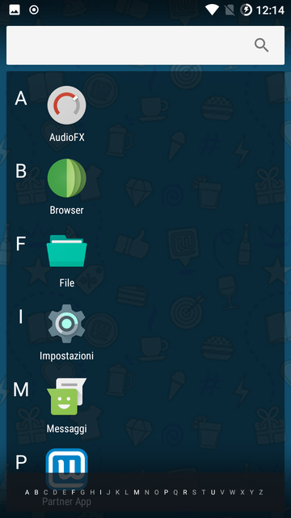
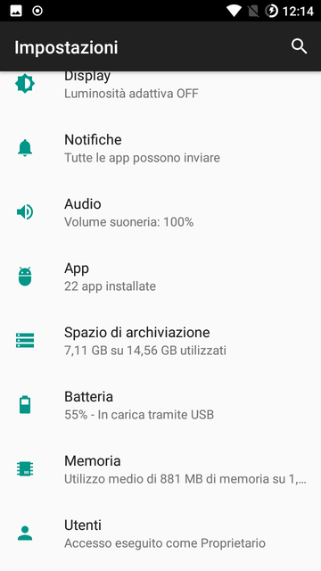
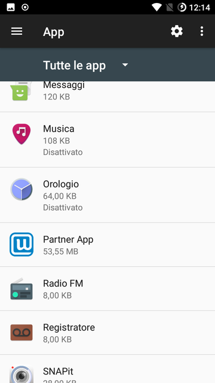
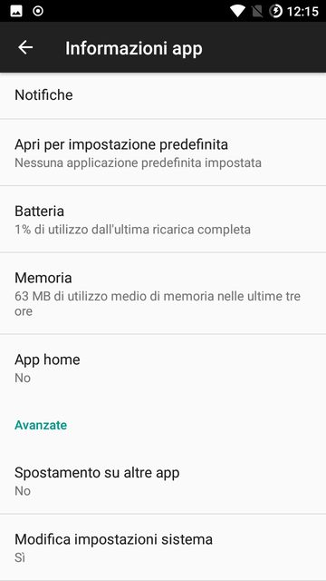
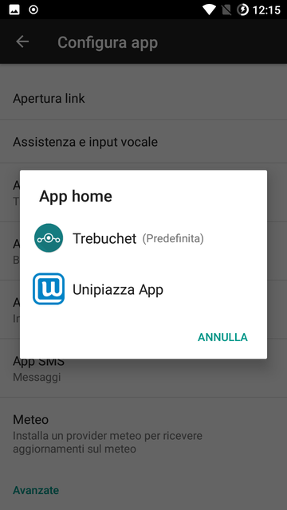
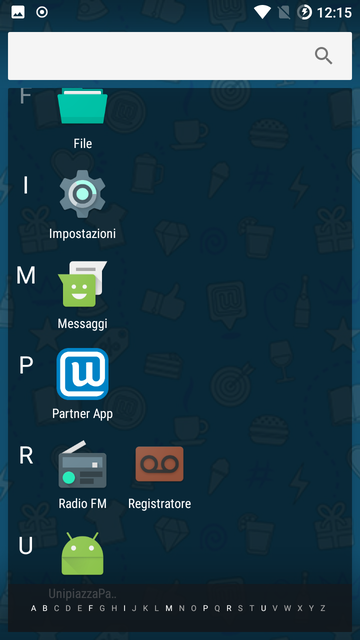

Se ti trovi davanti alla schermata Home del telefono, invece che la schermata Unipiazza, segui questi semplici passaggi!  **Accedi alle Impostazioni del Dispositivo**

Dalla schermata Home, tocca l'icona in basso **"Impostazioni"**.

**Seleziona la Sezione "App"**

-   Scorri verso il basso e tocca **"App"** o **"Applicazioni"**, a seconda del modello del tuo dispositivo.
    

**Trova e Seleziona "Partner App"**

-   Nell'elenco delle app installate, cerca **"Partner App"** e toccala per accedere alle informazioni dell'app.
    

**Imposta Unipiazza come App Home Predefinita**

-   All'interno delle informazioni dell'app, cerca l'opzione **"App Home"**.
    

-   Clicca nuovamente su **"App Home"** e scegli **"Unipiazza App"**
    

-   Ritorna alle **"Impostazioni"** e clicca sull'app **"Unipiazza"**.
    

Se, dopo aver seguito questi passaggi, l'app Unipiazza non appare come schermata iniziale, riavvia il dispositivo e ripeti la procedura.

Per ulteriori assistenza, contattaci al 388 8665987 o via email a [partner@unipiazza.it.](partner@unipiazza.it)
