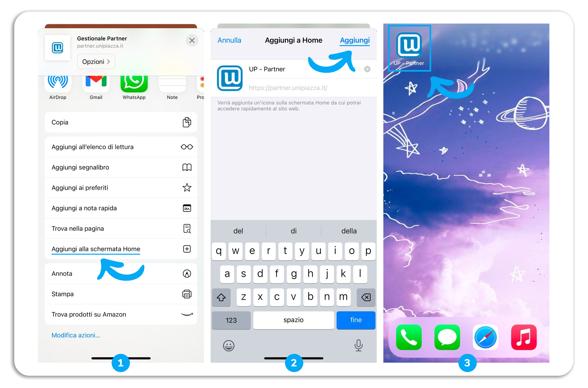
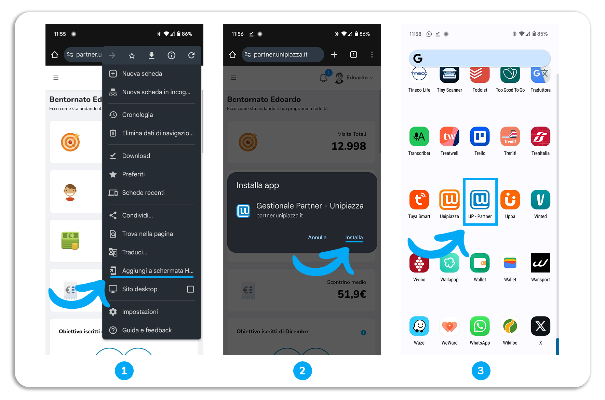

Vuoi avere la comodità di accedere al gestionale Unipiazza direttamente dal tuo smartphone? Segui questi semplici passaggi per iPhone (Safari e Chrome) e Android (Chrome).

### **Aggiungi il collegamento su Smartphone iPhone (Safari&Chrome)**

1) **Apri Safar**i: Avvia il browser Safari sul tuo iPhone.

2) **Vai a** [**partner.unipiazza.it**](https://partner.unipiazza.it): Nella barra degli indirizzi, digita l'URL `partner.unipiazza.it` e premi "Vai".

3) **Aggiungi alla Schermata Home**:

\- Premi il pulsante di condivisione (un quadrato con una freccia verso l'alto) situato nella parte inferiore del browser.

\- Scorri verso il basso e premi "Aggiungi alla schermata Home".

\- Assegna un nome all'icona, ad esempio "Unipiazza Gestionale".

\- Premi "Aggiungi". Ora troverai l'icona sulla tua schermata Home e potrai accedere rapidamente come se fosse un'App. 

### **Aggiungi il collegamento su Smartphone Android (Chrome)**

1) **Apri Chrome**: Avvia il browser Chrome sul tuo dispositivo Android.

2) **Vai a** [**partner.unipiazza.it**](https://partner.unipiazza.it): Nella barra degli indirizzi, digita l'URL `partner.unipiazza.it`

3) **Aggiungi a Schermata Home**:

\- Premi il pulsante del menu (tre puntini verticali) situato nell'angolo in alto a destra del browser.

\- Seleziona "Aggiungi a schermata Home".

\- Premi “Installa". Ora troverai l'icona sulla tua schermata Home e potrai accedere rapidamente come se fosse un'App.

<table style="min-width: 25px"><colgroup><col></colgroup><tbody><tr><td colspan="1" rowspan="1">
<strong>💡Suggerimento:&nbsp; </strong>Se hai problemi con le credenziali, contattaci al 388 8665987 o partner@unipiazza.it<strong>.</strong>
</td></tr></tbody></table>
