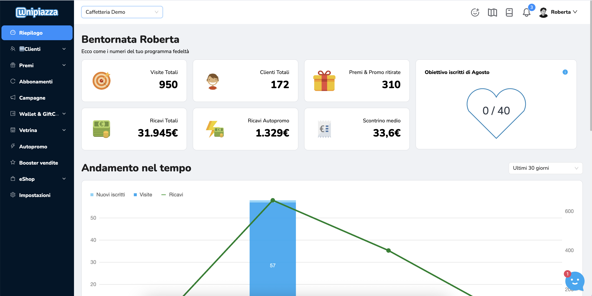

Sai che la sezione "[Riepilogo](https://partner.unipiazza.it/)" nel tuo Gestionale Unipiazza è come una mappa del tesoro per il tuo programma fedeltà? È qui che trovi tutte le informazioni importanti che ti mostrano come stanno andando le cose nel tuo locale. Vediamo insieme cosa puoi scoprire in questa sezione.

-   **Visite Totali:** Questo numero ti dice quante volte i clienti hanno raccolto gettoni nella tua attività commerciale
    
-   **Clienti:** Qui scopri quanti clienti hanno raccolto gettoni almeno una volta da te 
    
-   **Scontrino Medio:** Questo è lo scontrino medio dei clienti che hanno raccolto gettoni
    
-   **Ricavi Totali:** Qui vedi il totale dei soldi spesi dai clienti che hanno raccolto gettoni (1€ = 10 Gettoni)
    

**Obiettivo di Iscritti Mensile**

A tutti piacciono gli obiettivi, giusto? Nella sezione "Riepilogo" trovi un grafico che ti mostra quanto sei vicino a raggiungere il tuo obiettivo di nuovi iscritti ogni mese. Questo numero conteggia tutti i clienti che si sono iscritti con un tessera sul Chiosco o hanno raccolto gettoni per la prima volta durante quel mese. Puoi modificare l'obiettivo di iscritti mensile direttamente dalla sezione impostazioni.

**Analisi delle Visite e Iscrizioni**

In questa parte vedi un grafico che ti mostra quante visite e iscrizioni hai avuto in un periodo specifico. Puoi scegliere di vedere i dati dell'ultima settimana, dell'ultimo mese o dell'ultimo anno. Sotto il grafico trovi anche altri dati utili.

**Ultime 10 Azioni dei Clienti**

Qui in fondo trovi una tabella delle ultime 10 azioni dei tuoi clienti che possono includere la raccolta gettoni, le iscrizioni, il ritiro di promozioni, premi o altro. Premi su “Mostra tutte le azioni” per vederle tutte.
