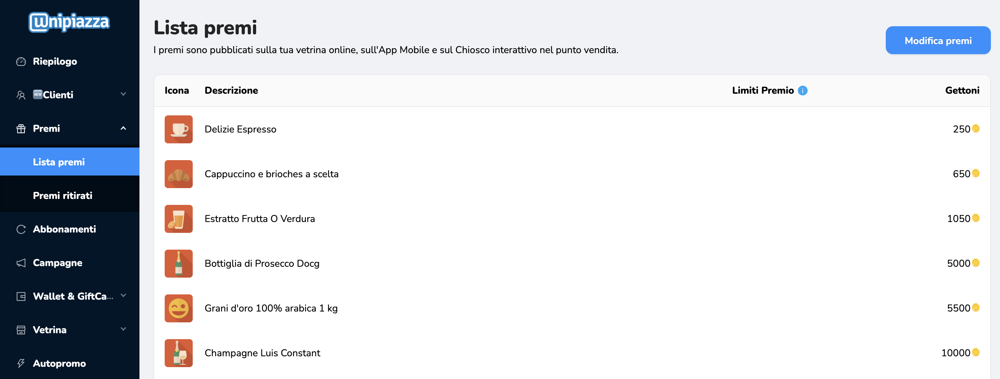
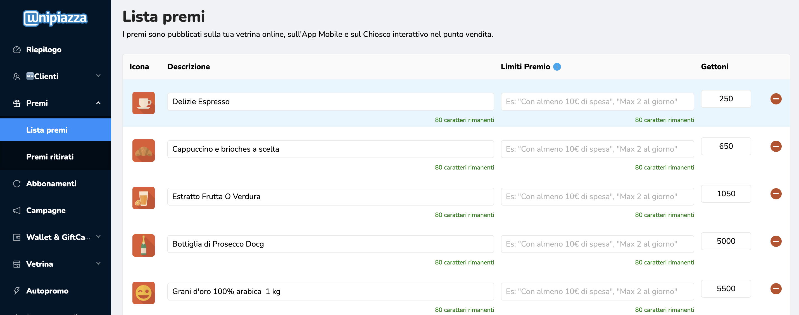
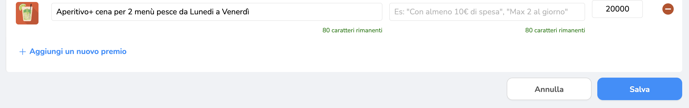

Vorresti limitare il ritiro di un premio per cliente, ad esempio a **uno al giorno**? Tramite il gestionale Unipiazza, è possibile aggiungere una descrizione ai premi per comunicare queste regole direttamente ai clienti. Ecco come fare:

**1\. Accedi alla lista premi**

Dal menu principale del gestionale, clicca su **"Premi"** e seleziona **"Lista premi"**. Qui troverai l’elenco di tutti i premi attivi nella tua vetrina online, sull’app mobile e sul chiosco interattivo.

**2\. Modifica il premio**

Individua il premio per cui desideri impostare un limite e clicca su **"Modifica premi"** in alto a destra. Nella colonna **"Limiti Premio"**, puoi aggiungere una breve descrizione (fino a 80 caratteri) per specificare le regole di ritiro.

**3\. Scrivi una descrizione chiara**

Nella descrizione, puoi indicare regole come:

-   "Max 1 premio al giorno"
    
-   "Valido con almeno 10€ di spesa"
    
-   "Ritirabile una volta a settimana"
    

Assicurati che il testo sia semplice e diretto, in modo che sia facilmente comprensibile dai tuoi clienti.

**4\. Salva le modifiche**

Dopo aver aggiunto le descrizioni, clicca su **"Salva"** in basso.

Le regole saranno visibili ai clienti sia nel chiosco che nella vetrina online, aiutandoti a gestire meglio il ritiro dei premi.
