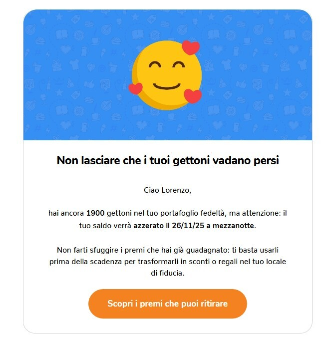
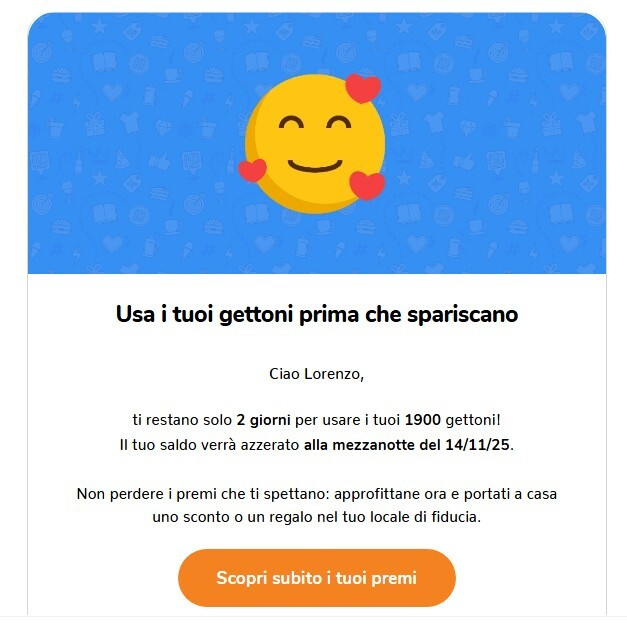

Se vuoi resettare i gettoni dei tuoi clienti, puoi programmare il reset in autonomia direttamente dal tuo Gestionale. Le visite, i premi già ritirati e le altre statistiche non saranno toccati. Puoi scegliere se azzerare i gettoni a **tutti i clienti** oppure solo a una **lista specifica**.

Per iniziare:

1.  Accedi al [Gestionale Unipiazza](https://partner.unipiazza.it).
    
2.  Vai su **Impostazioni**.
    
3.  Cerca la sezione **"Resetta i gettoni clienti"**.
    

## Resettare i gettoni di tutti i clienti

Puoi impostare in anticipo la data in cui desideri che tutti i gettoni vengano azzerati.

1.  In corrispondenza di **"Resetta i gettoni clienti"**, clicca su **"Programma cancellazione"**.
    
2.  Scegli la **data di azzeramento** dal calendario.
    
3.  Se vuoi avvisare i tuoi clienti, attiva l'opzione **“Invia un promemoria ai clienti 14 e 2 giorni prima”**.
    
4.  Conferma cliccando su **"Conferma cancellazione"**.
    

## Resettare i gettoni solo di una lista

Se preferisci, puoi azzerare i gettoni **solo dei clienti che appartengono a una tua lista personalizzata**: è utile, ad esempio, per chi non torna da mesi o per situazioni specifiche.

1.  Nella sezione **"Resetta i gettoni per lista"**, seleziona la **lista** dal menu a tendina (vedrai anche quanti clienti ne fanno parte).
    
2.  Clicca su **"Programma cancellazione"**.
    
3.  Scegli la **data di azzeramento** dal calendario.
    
4.  Se vuoi avvisare i clienti della lista, attiva l'opzione **“Invia un promemoria ai clienti 14 e 2 giorni prima”**.
    
5.  Conferma cliccando su **"Conferma cancellazione"**.
    

In entrambi i casi il reset avverrà alle **23:59** del giorno selezionato e potrai **annullarlo in qualsiasi momento** prima di quella data.

Se hai attivato l'opzione, i clienti riceveranno automaticamente un'email e/o un messaggio RCS che li informa della scadenza 14 giorni prima e 2 giorni prima la data scelta.  Ecco la comunicazione che verrà inviata 14 giorni prima 👇

Ecco la comunicazione che verrà inviata 2 giorni prima 👇

💡 _Il promemoria è facoltativo, ma consigliatissimo: aiuta i tuoi clienti a usare gli ultimi gettoni prima dell’azzeramento._
