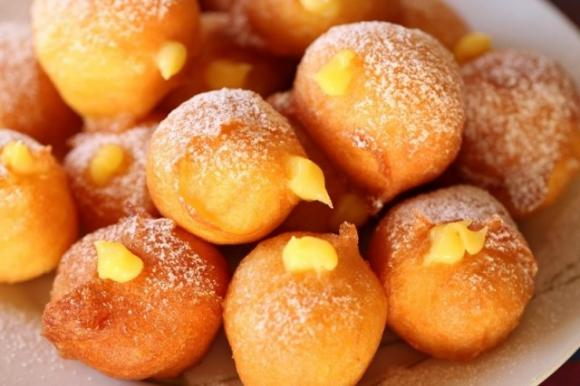

**A carnevale ogni scherzo vale!** 

Nemmeno il tempo di finire i panettoni che già ci dobbiamo occupare di cosa fare a Carnevale. Bar e pasticcerie inebriano i nostri sensi con il profumo di crostoli e frittelle ogni volta che ci passiamo davanti. 

Cosa fare per carnevale? Che ne dite di una bella Campagna e-mail. Che sia uno sconto o la semplice presentazione di un prodotto, comunicatelo!

Qui sotto potete trovare esempi di testi e immagini che potete tranquillamente copiare e utilizzare adattandoli alle vostre esigenze.

 

## **Testo**

Titolo: (nome), per te  subito 20% di sconto. 🥰

“Ciao (nome), 👋🏼

A Carnevale ogni scherzo vale! Ma da noi no! 

Nel nostro negozio potrai trovare il 20% di sconto su tutti i prodotti in esposizione e non è uno scherzo! 

Non ci credi? Vieni a trovarci.😉”

 

Titolo: (nome),Visita il nostro sito e scopri le nostre offerte. 😉

“Ciao (nome), 👋🏼

Visita il nostro store online! Per te fantastiche sorprese, non lasciarti sfuggire le nostre offerte esclusive! 

😉(Visita il sito)”

 

**🧁** _**Special ristorazione**_ 🧁

Titolo: (nome), le nostre specialità di Carnevale sono arrivate! 😋

“Ciao (nome), 👋🏼

A carnevale vieni a provare i nostri crostoli e le nostre frittelle ripiene. 

Le puoi trovare ai gusti:

Crema 

Zabaione 

(aggiungi gusti)

Grandi o piccole non lasciartele scappare!😍”

 

## **Immagini**

 

 

 

 

 

Se stai cercando altre fonti di ispirazione, leggi [il nostro articolo](https://unipiazza.customerly.help/modelli-campagne/siti-per-scaricare-immagini-gratuiti?preview=eyJ0aW1lc3RhbXAiOjE2MTQyNDMxNTAsImNoZWNrc3VtIjoiNjA3OGE5ZTljYTU4YWQ3MzI5NWYwYTQ0MzM2NGMyYTgifQ==) sui migliori siti in italiano per scaricare immagini gratuite!
