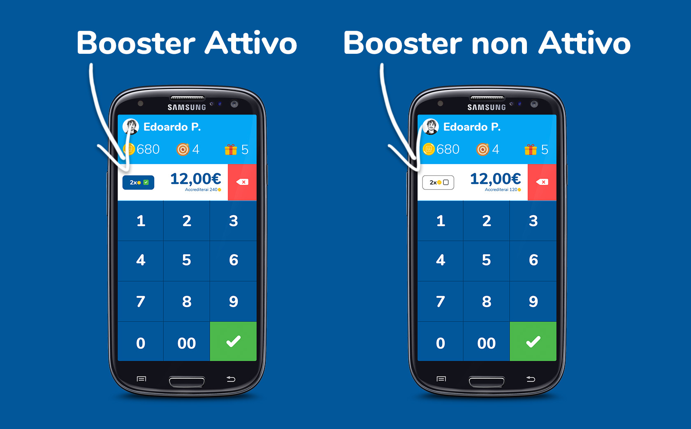

I [Booster](https://partner.unipiazza.it/boosters) permettono di premiare i clienti con gettoni doppi o gettoni extra e sono lo strumento perfetto per aumentare il traffico nei giorni o orari a bassa affluenza o per incentivare l'acquisto di un determinato prodotto o servizio.  Vediamo degli esempi per capire meglio: 

-   _Voglio avere più clienti il martedì a pranzo_ > Attivo un Booster moltiplicatore che accredita doppi gettoni a tutti i clienti che vengono dalle 12:00 alle 14:00 il martedì. 
    
-   _Voglio promuovere un nuovo servizio del mio centro estetico_ > Attivo un Booster gettoni extra che premia con 200 gettoni tutti i clienti che acquistano quel servizio
    

Una volta che attiverai i Booster, quando i clienti appoggeranno la propria tessera o inquadreranno il QR Code ti comparirà un nuovo bottone sul tuo Smartphone nella schermata di accredito. Questo bottone potrà essere già attivo o sarà da premere per l'attivazione in base alle impostazioni che hai selezionato (checkbox “Attiva automaticamente”)

Se il Booster è attivo, in automatico il cliente riceverà i suoi gettoni omaggio (grazie al moltiplicatore o ai gettoni extra) e verranno conteggiati in modo diverso sul gestionale. 

 Potrai vedere i Booster attivi e quanti profitti ti stanno portando dalla sezione “Booster Vendite”. Ecco le informazioni che vedrai:

-   **Booster**: Il nome dell'offerta o promozione.
    
-   **Stato**: Mostra se il Booster è attivo o no.
    
-   **Visite generate:** Numero di clienti che hanno approfittato del Booster.
    
-   **Profitti generati**: Guadagni ottenuti grazie al Booster.
    
-   **Attivo dal/al:** Periodo di validità del Booster.
    
-   **Giorni:** I giorni della settimana in cui il Booster è valido.
    

<table><tbody><tr><td colspan="1" rowspan="1">
<strong>💡Suggerimento: </strong>&nbsp;Nella sezione “Analisi Clienti” trovi un grafico che ti mostra il traffico dei tuoi clienti nei giorni e nelle fasce orarie della settimana. Usa queste informazioni per capire in che giorni e orari è meglio attivare i booster!
</td></tr></tbody></table>
