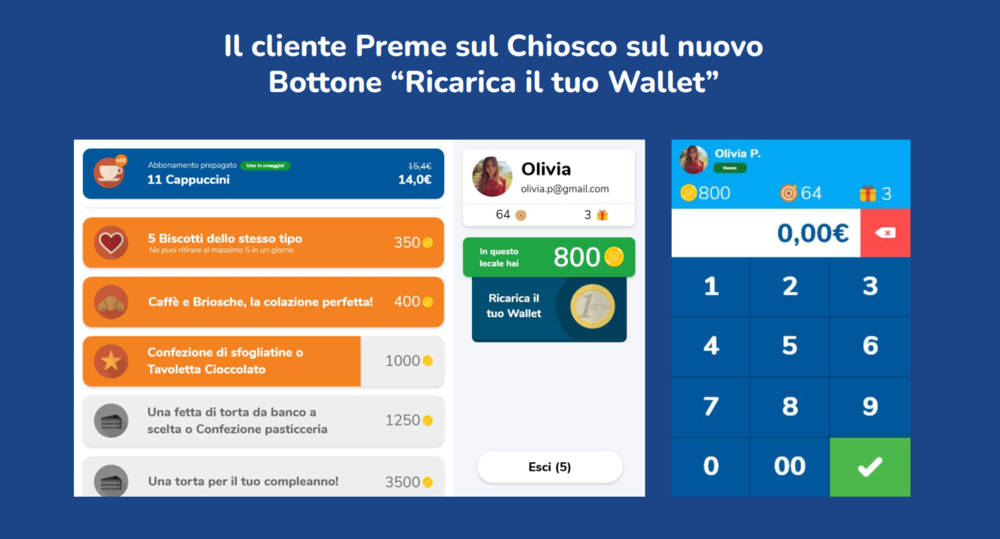
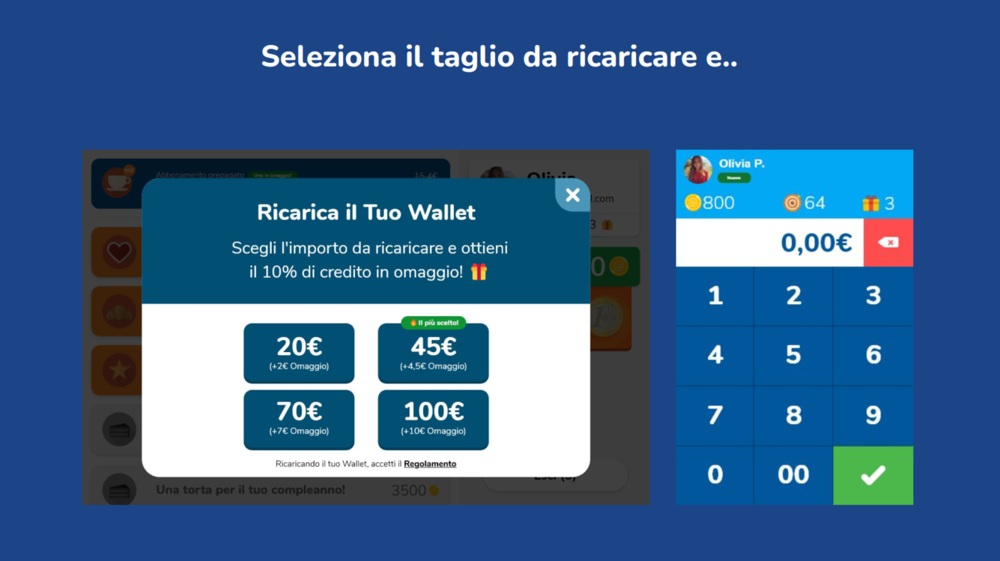
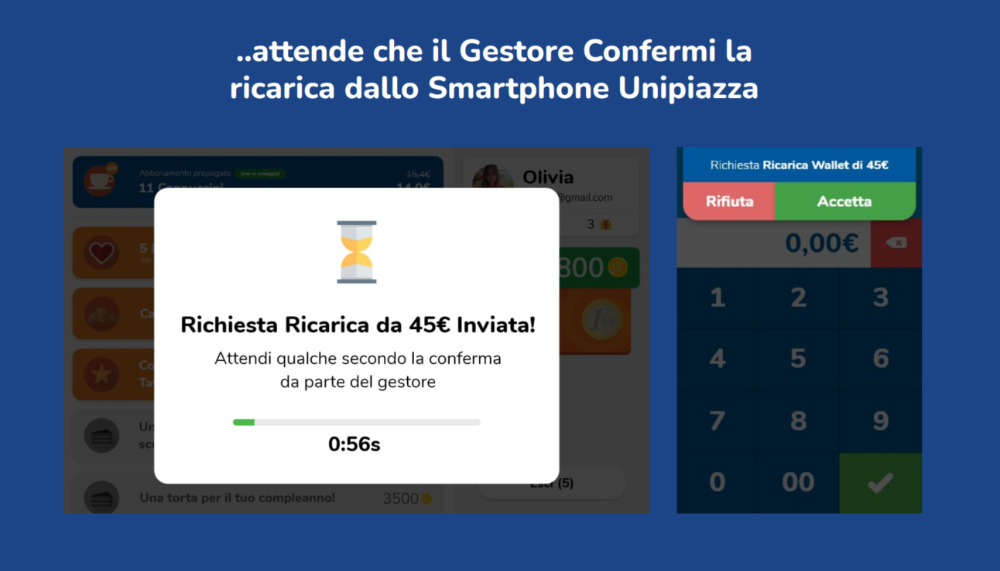
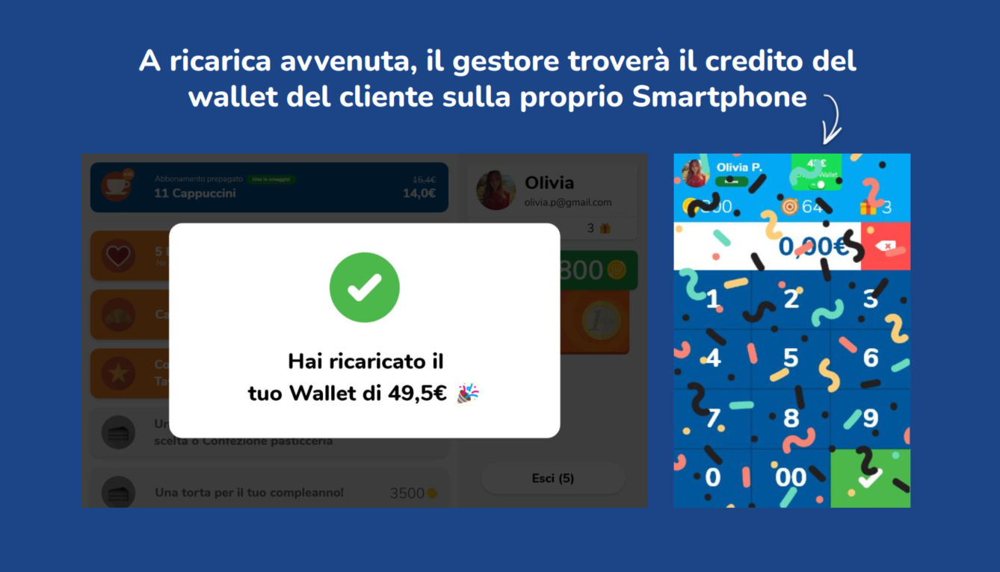
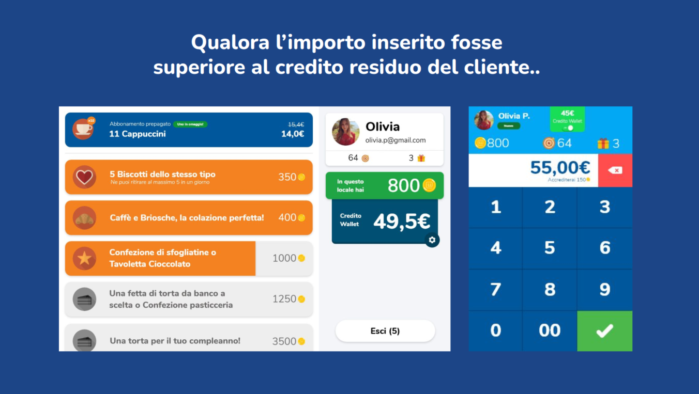
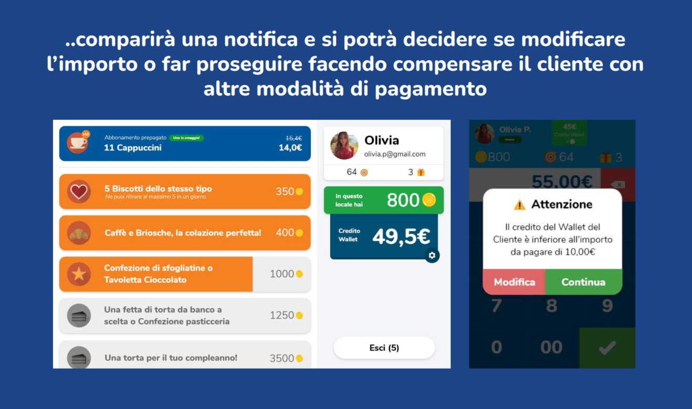
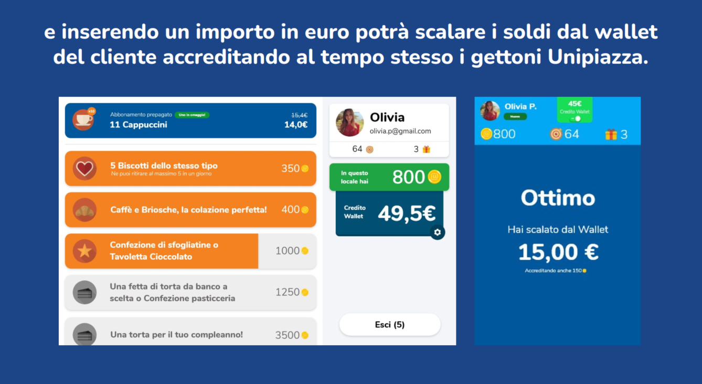

Il Wallet Unipiazza è una soluzione di pagamento digitale pensata per semplificare e velocizzare le transazioni. Con esso, i tuoi clienti possono pre-caricare il credito e utilizzarlo presso la tua attività, garantendo acquisti rapidi e fedeltà alla tua marca.

Perché dovresti attivare questa funzionalità?

1.  **Incassi Anticipati:** I clienti pre-caricano il loro credito, garantendoti un flusso di cassa in anticipo.
    
2.  **Fidelizzazione:** Rafforza il legame con i tuoi clienti offrendo loro un metodo di pagamento comodo e personalizzato.
    
3.  **Operazioni in Cassa Veloci:** Riduci le attese e migliora l'efficienza del tuo punto vendita.
    
4.  **Promozioni Personalizzate:** Hai la libertà di offrire incentivi unici per le ricariche, attirando così più clienti.
    

**Come funzionano i Wallet?** 

Nella sezione "Wallet prepagati" del Gestionale, puoi visualizzare una lista dei clienti che hanno attivato il proprio Wallet. Questa lista fornisce dettagli quali:

-   Nome del cliente
    
-   Credito acquistato dal cliente
    
-   Credito rimanente nel Wallet del cliente
    
-   Ultima ricarica effettuata dal cliente
    
-   Data di scadenza del credito nel Wallet (se applicabile)
    

<table style="min-width: 25px"><colgroup><col></colgroup><tbody><tr><td colspan="1" rowspan="1">
💡<strong>Fai regalare un “Wallet” ai clienti!</strong> Attiva la funzionalità “GiftCard” per far regalare del credito Wallet ai tuoi clienti. <a target="_blank" rel="noopener noreferrer nofollow" href="https://unipiazza.customerly.help/it/wallet-e-gift-card/cosa-sono-e-come-si-attivano-le-giftcard">Leggi da qui</a> come puoi fare.
</td></tr></tbody></table>

Impostare il [Wallet Unipiazza](https://partner.unipiazza.it/wallet) nel tuo gestionale è un modo semplice per incentivare i pagamenti e premiare i tuoi clienti. Ecco come fare:

-   **Accedi alla Sezione "**[**Impostazioni Wallet & Gift Card**](https://partner.unipiazza.it/wallet/impostazioni)**":** Troverai questa opzione nel menù del tuo gestionale Unipiazza. Qui puoi gestire tutte le impostazioni relative al Wallet.
    
-   **Attiva la Funzionalità "Wallet Prepagato":** Spunta la casella per attivare il Wallet. Questo ti permetterà di iniziare a offrire ai tuoi clienti la possibilità di caricare il loro Wallet e usufruire degli incentivi.
    
-   **Tagli di Acquisto o Ricarica Wallet:** Imposta fino a sei tagli di ricarica per il Wallet, come 20€, 50€, 100€, ecc. Questi rappresentano le opzioni che i tuoi clienti vedranno quando decidono di ricaricare il loro Wallet.
    
-   **Incentiva i Pagamenti Tramite il Wallet:** Seleziona questa opzione per dare gettoni extra ai clienti che pagano con il Wallet. Ad esempio, potresti offrire un moltiplicatore di gettoni, come 1,5 gettoni per ogni euro speso.
    
-   **Incentiva le Ricariche del Wallet:** Puoi decidere di dare ai tuoi clienti una percentuale di credito extra ad ogni ricarica. Per esempio, con il 10% di credito extra, ricaricando 50€, i clienti otterranno 5€ in più, per un totale di 55€ nel Wallet.
    
-   **Limiti di Credito:** Imposta un limite massimo di credito che i clienti possono caricare nel loro Wallet, come 250€, per mantenere il controllo sulle ricariche.
    
-   **Etichetta 'Il più Scelto':** Seleziona il taglio di ricarica che vuoi promuovere come il più vantaggioso o popolare. Questo taglio avrà un'etichetta speciale che aiuterà a guidare i clienti nella scelta.
    
-   **Salva le Impostazioni:** Dopo aver configurato tutte le opzioni, clicca su "Salva" per applicare le modifiche.
    

<table style="min-width: 25px"><colgroup><col></colgroup><tbody><tr><td colspan="1" rowspan="1">
💡<strong>Ricordati di promuoverli:</strong> Una volta che hai attivato la funzionalità Wallet, ricordati di creare una campagna da inviare ai tuoi clienti per informarli! Usa i nostri template che trovi qui per trovare ispirazione
</td></tr></tbody></table>

<table style="min-width: 25px"><colgroup><col></colgroup><tbody><tr><td colspan="1" rowspan="1">
<strong>💡Nota bene!</strong> I Wallet sono specifici per le singole attività commerciali anche se un cliente potrà avere più wallet sul proprio profilo. Questo vuol dire che se ricarica del credito Wallet nella tua attività commerciale, quel credito potrà spenderlo SOLO da te (o nei punti vendita legati alla tua catena in caso tua faccia parte di una catena!
</td></tr></tbody></table>
