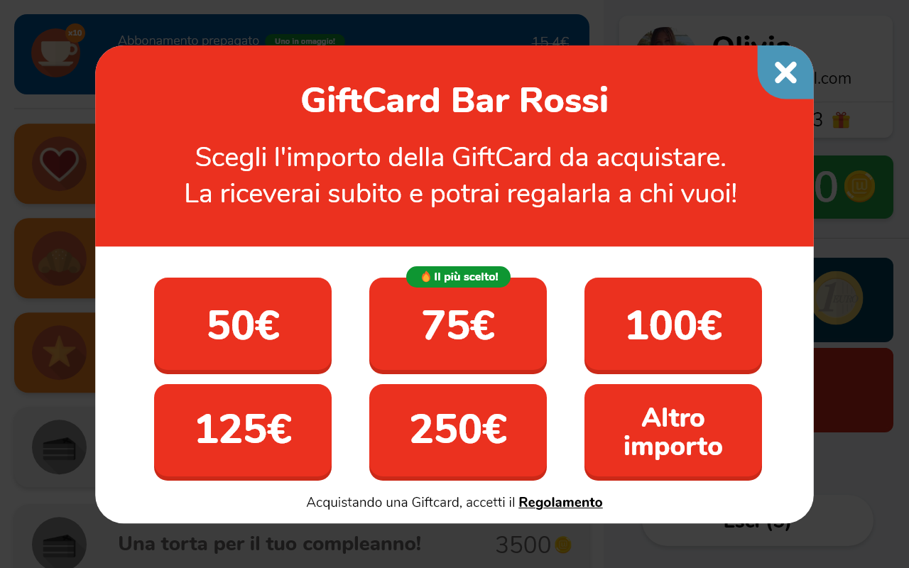

<iframe src="https://www.youtube.com/embed/2dLSuiFcImo" frameborder="0" allowfullscreen="true"></iframe>

La [GiftCard](https://partner.unipiazza.it/wallet) di Unipiazza non è un semplice buono regalo. Si tratta di una estensione del Wallet, che permette agli utenti di regalare a terzi del credito Wallet da spendere in una specifica attività commerciale (o catena). Analogamente al Wallet, le GiftCard vengono acquistate direttamente nel punto vendita attraverso il Chiosco.

**Come funzionano?**

-   Il cliente seleziona il valore della GiftCard desiderata tramite il Chiosco (tu sceglierai quanti e quali tagli mettere, max taglio 250€).
    
-   Sul tuo Smartphone o Registratore di cassa potrai confermare l’operazione.
    

Ecco cosa succede quando un cliente vuole riscattare una Giftcard: 

1.  Digli di appoggiare la GiftCard sul Chiosco
    
2.  Gli verrà chiesto se è già iscritto o no: se è iscritto inserirà l’email con la quale è iscritto, se non è iscritto si iscriverà inserendo nome cognome e email
    
3.  Inseriti i dati comparirà la lista premi del tuo locale e vedrà a destra il saldo della propria Giftcard (che si chiamerà saldo Wallet)
    

Il credito Wallet verrà scalato in automatico ad ogni raccolta gettoni (leggi [l’articolo sul Wallet](https://unipiazza.customerly.help/it/wallet-e-gift-card/cosa-sono-e-come-si-attivano-i-wallet) per capire meglio) e potrai vedere il suo saldo direttamente sul tuo Smartphone o Registratore di Cassa.

<table style="min-width: 25px"><colgroup><col></colgroup><tbody><tr><td colspan="1" rowspan="1">
<strong>💡Raccolta gettoni GiftCard!</strong> I clienti che acquistano una GiftCard raccolgono gettoni grazie all'importo speso e anche i clienti che riscattano e acquistano usando il credito GiftCard raccolgono gettoni. Abbiamo mantenuto questa possibilità per incentivare la fedeltà anche dei nuovi clienti a cui è stata regalata la GiftCard.&nbsp;
</td></tr></tbody></table>

<table style="min-width: 25px"><colgroup><col></colgroup><tbody><tr><td colspan="1" rowspan="1">
<strong>💡Nota Bene! </strong>Per evitare spiacevoli situazioni, vi suggeriamo di impedire ai clienti di acquistare delle GiftCard usando il credito Wallet.
</td></tr></tbody></table>
