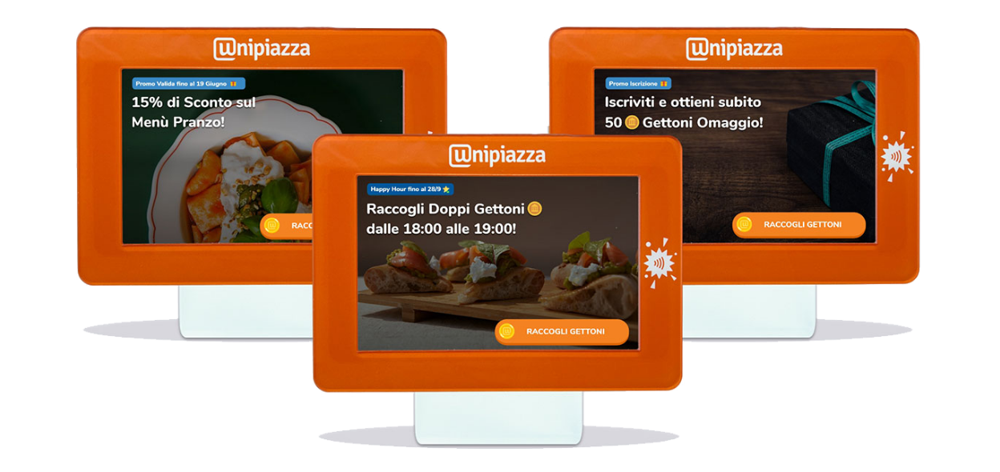
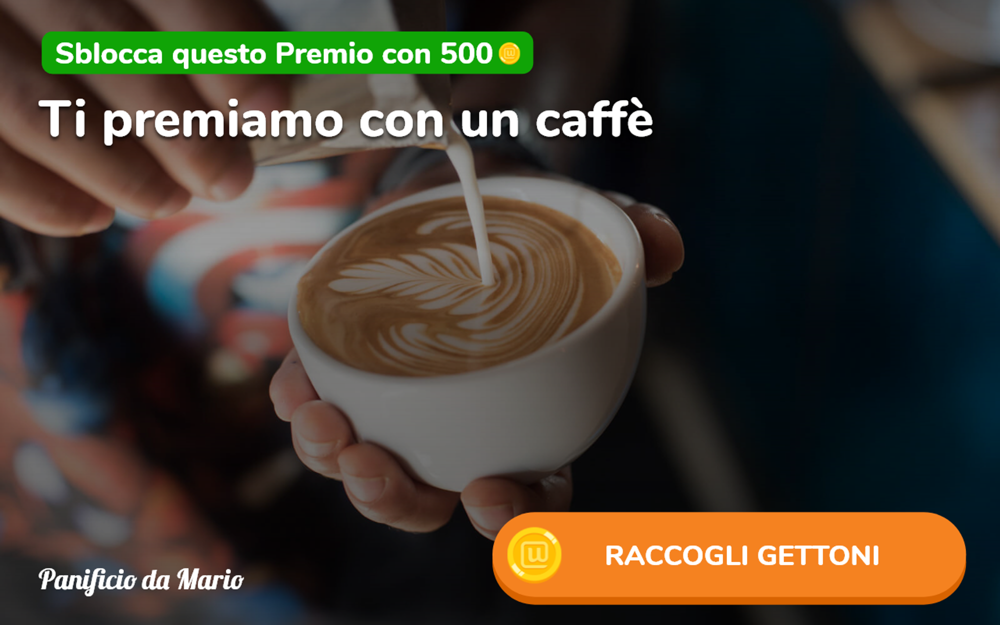
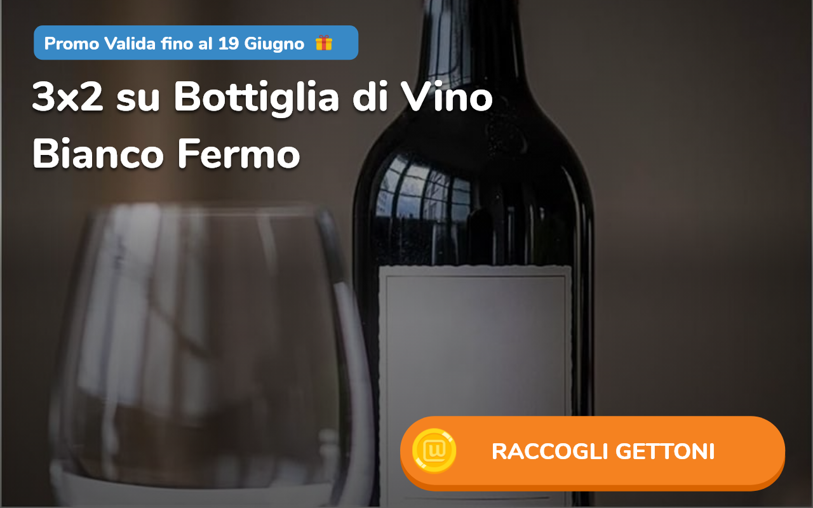
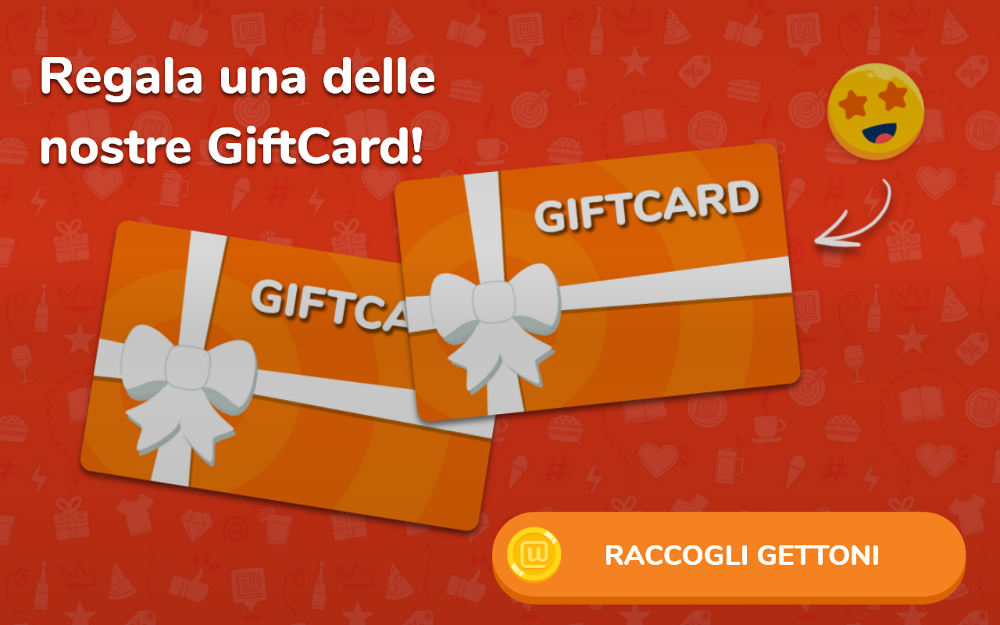

La sezione del Gestionale [Cover Chiosco](https://partner.unipiazza.it/cover) ti permette di selezionare quali immagini (o cover) appariranno sul tuo Chiosco. Queste immagini sono fondamentali per attirare l'attenzione dei tuoi clienti e per comunicare offerte speciali, promozioni o novità.

Dovrai avere sempre almeno due cover attive e potrai attivarle o disattivarle quando vuoi in base alle tue esigenze promozionali o stagionali. 

Ecco alcuni esempi per sfruttare le cover: 

1.  **Premi Fedeltà**
    
    Incentiva i tuoi clienti ad iscriversi creando delle Cover ad Hoc che pubblicizzano dei premi Fedeltà. 
    

2.  **Offerte Speciali**
    
    Utilizza una cover per mostrare un'offerta speciale, come "3x2 su Bottiglia di vino bianco fermo”
    

3.  **Eventi o Novità**
    
    Hai un nuovo prodotto o un evento speciale? Evidenzialo con una cover.
    

.png)

4.  **Promozioni Stagionali**
    
    Le festività sono un ottimo momento per creare cover tematiche che attirano l'attenzione.
    

.png)

5.  **Promo Iscrizione**
    
    Invita i tuoi clienti creando una Cover che li ingolosisca. Degli Esempi “Iscriviti e ottieni subito 50 gettoni”, “Iscriviti e inizia a premiarti!”
    

.png)

6.  **Booster Gettoni**
    
    Pubblicizza un Booster gettoni se è attiva in quell’esatto giorno e orario (sia che si tratti di un Booster “Moltiplicatore” che di Booster “Gettoni Doppi”). 
    

.png)

7.  **Abbonamenti Prepagati**
    
    Pubblicizza gli Abbonamenti Prepagati attivi in quell’esatto giorno e orario.
    

.png)

8.  **GiftCard**
    
    Promuovi le tue GiftCard con una cover che invita i clienti a scoprirne i benefici, ideale per regali o come comodo metodo di pagamento anticipato.  
    

9.  **Wallet Gettoni **Utilizza una cover per far conoscere il Wallet, uno strumento pratico per raccogliere gettoni e accedere a vantaggi esclusivi presso il tuo locale.  
    

<table><tbody><tr><td colspan="1" rowspan="1">
<strong>🥳Viva le automazioni! </strong>Ogni volta che crei un abbonamento, un booster, invii una campagna evento o attivi Wallet e GiftCard, puoi spuntare la funzione “Promuovi sul Chiosco Automaticamente” per far creare in automatico un’immagine Cover sul Chiosco. Sfrutta questa opzione per risparmiare tempo e ottimizzare le tue promozioni!&nbsp;
</td></tr></tbody></table>
