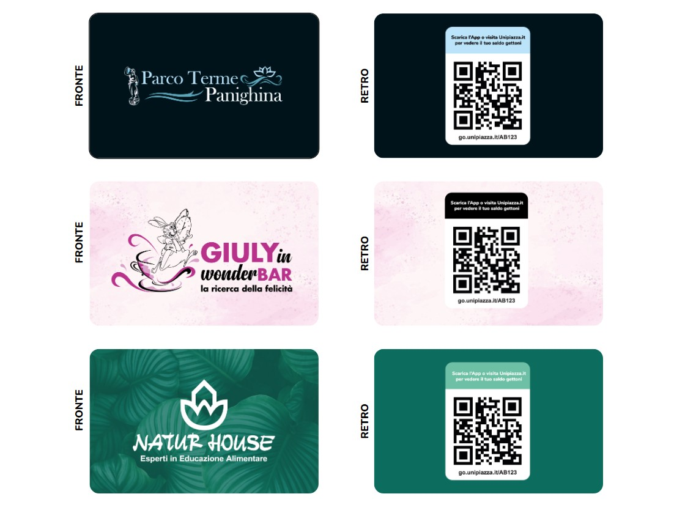
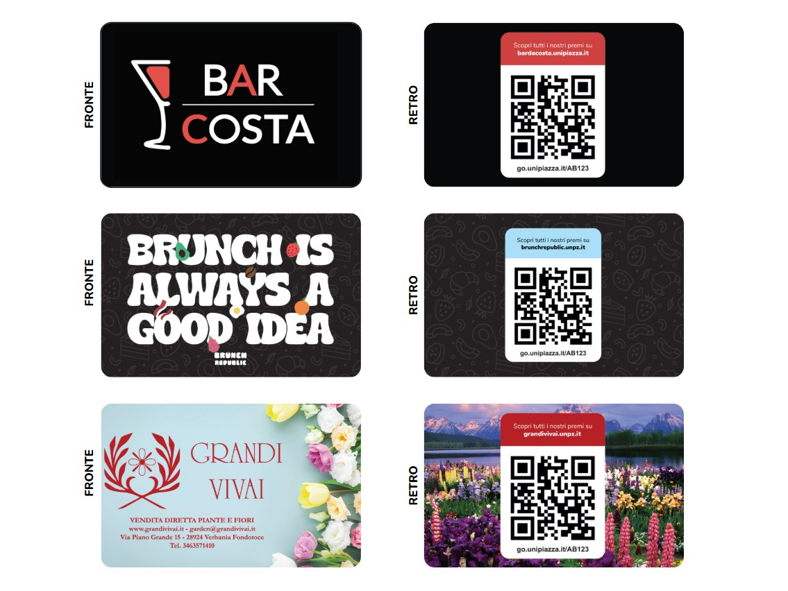

Vuoi che le tue Tessere Fedeltà siano perfettamente in linea con l’identità del tuo locale? Con Unipiazza puoi personalizzarle graficamente e renderle uniche: il tuo logo, i tuoi colori, il tuo stile. Un piccolo tocco che le trasforma in un vero biglietto da visita per la tua attività 😍  Ti spieghiamo cosa puoi personalizzare, come creare la grafica, quanto costa e come ordinarle.

**Cosa puoi personalizzare (e cosa no)**

Le Tessere Fedeltà hanno due lati, con libertà diverse:

🎨 **Fronte: campo libero** Puoi personalizzare interamente il lato frontale della tessera, senza limiti grafici. Colori, immagini, logo, pattern: come preferisci tu.

🎨 **Retro: colori a tua scelta** Puoi personalizzare il colore di sfondo della tessera (tinte unite, gradienti o pattern di qualunque tipo) e il colore del box e del testo ("Scarica l’App o visita…").

🔒 **Retro: il box del QR Code resta così** Il box con lo sfondo bianco, il QR Code e il codice sotto non sono modificabili: servono al corretto funzionamento del programma fedeltà.

Trovi tutti i dettagli, le misure e gli esempi nella guida completa: 📄 [Scarica la guida con le specifiche grafiche](https://unpz.it/tessere-personalizzate)

**Lasciati ispirare: alcuni esempi**

Ogni attività ha reso le sue Tessere uniche a modo suo. Ecco qualche esempio:

**Come creare la grafica: 3 modalità**

La grafica va fornita già pronta. Puoi crearla in tre modi, in base al risultato che cerchi e al tempo che hai:

1️⃣ **Fai da Te** Adatto a chiunque. Personalizzi da solə il design delle tessere in pochi minuti usando Canva, il sito gratuito di grafica. Zero sbatti.

2️⃣ **Professionale** Adatto a chi ha competenze grafiche o lavora con un’agenzia. Scarichi i layout ufficiali delle tessere e li personalizzi con un software di grafica vettoriale (es. Adobe Illustrator, GIMP o Inkscape).

3️⃣ **Su misura** Adatto a chi vuole il miglior risultato nel minor tempo possibile. Ci spieghi la grafica che vorresti e in pochi giorni un nostro designer ti invia 2 proposte già pronte. Costo: **99€ + IVA**.

**Quanto costano le Tessere Fedeltà personalizzate**

Il prezzo di stampa dipende dalla quantità che ordini (ordine minimo 500 tessere):

1️⃣ **500 Tessere: 300€** (0,60€ a tessera)

2️⃣ **1.000 Tessere: 500€** (0,50€ a tessera)

3️⃣ **2.000 Tessere: 600€** (0,30€ a tessera)

Più tessere ordini, meno spendi per ognuna 😉

**Condizioni e tempistiche**

Prima di ordinare, tieni a mente qualche dettaglio importante:

1️⃣ **La grafica la prepari tu** Il file grafico deve arrivarci già pronto. Noi ci occupiamo solo della stampa (a meno che tu non scelga la modalità Su misura, e in quel caso ci pensiamo noi).

2️⃣ **Produzione in 4 settimane lavorative** Dal via libera alla consegna passano circa 4 settimane lavorative. Meglio muoversi con un po’ di anticipo!

3️⃣ **Quando parte l’ordine** L’ordine parte ufficialmente solo dopo che abbiamo ricevuto la tua grafica corretta e il saldo anticipato.

**Vuoi personalizzare le tue Tessere Fedeltà?** Contatta il nostro team e rendi il tuo programma fedeltà ancora più riconoscibile!
