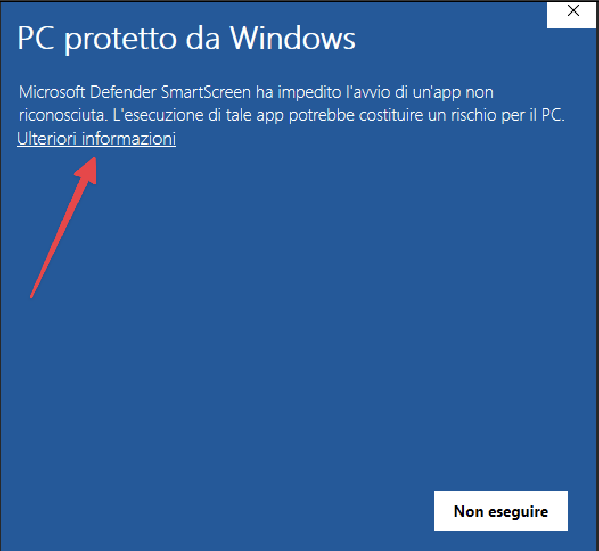

Abbiamo creato una versione desktop dell’App Operatore Unipiazza per accreditare gettoni direttamente dal tuo computer 🎉  1\. Scarica il programma

-   Apri il browser del tuo PC (Chrome, Edge o quello che usi di solito).
    
-   Vai su 👉 [unpz.it/desktop](https://unpz.it/desktop)
    
-   Il file .exe si scarica in automatico.
    

Se il browser ti mostra un avviso o blocca il file, clicca su **"Conserva comunque"** o **"Esegui comunque"**. Il programma è sicuro, lo abbiamo creato noi!   2\. Installa l'applicazione

-   Una volta scaricato, apri il file.
    
-   Se compare una schermata blu di Windows Defender, clicca su **"Ulteriori informazioni"** e poi su **"Esegui comunque"**.
    
-   Segui la procedura guidata cliccando su **Avanti** > **Installa**.
    
-   Ti consigliamo di spuntare l’opzione **“Crea un’icona sul desktop”** per trovarla più facilmente in futuro.
    

3\. Avvia e comunica il codice

-   L'app si aprirà automaticamente una volta completata l'installazione.
    
-   Nella schermata troverai un **codice identificativo** in basso.
    
-   Inviacelo via WhatsApp, così da attivare il collegamento con il tuo account Unipiazza! 
    

Questa integrazione è perfetta per chi vuole snellire l’operatività alla cassa e gestire tutto da un unico dispositivo. Zero smartphone, zero cavetti in più ✨

Se qualcosa non ti torna o hai bisogno di una mano, scrivici su WhatsApp al **388 8665987**!
