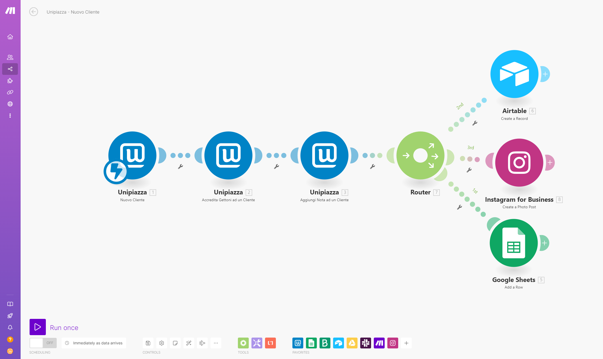

Zapier e Make sono strumenti potenti per automatizzare e integrare diversi servizi online. Con queste piattaforme, puoi creare delle automazioni che collegano Unipiazza ad oltre 10 mila altri strumenti e servizi, migliorando l'efficienza e le potenzialità del tuo programma fedeltà.

🔗 [Unipiazza su Zapier ](https://zapier.com/apps/unipiazza/integrations)🔗 [Unipiazza su Make](https://www.make.com/en/integrations/unipiazza)

Ecco alcuni esempi:

**Integrazione con Sistemi di Email Marketing**: Sincronizza automaticamente i nuovi iscritti di Unipiazza con le tue liste di email su ActiveCampaign o in Brevo (ex Sendinblue), mantenendo aggiornati i tuoi contatti per l'invio di newsletter e promozioni.

**Modulo di Iscrizione sul Sito Web**: Collega un modulo di contatto o di iscrizione sul tuo sito web a Unipiazza. Quando un utente compila il modulo, viene automaticamente aggiunto al programma fedeltà di Unipiazza e riceve un messaggio di benvenuto.

**Integrazione con Facebook e Instagram Ads:** Configura le tue campagne pubblicitarie su Facebook e Instagram in modo che i contatti raccolti attraverso i moduli di Lead Ads vengano automaticamente importati in Unipiazza. Questo è particolarmente utile per sconti, coupon e promozioni riservate ai nuovi clienti. Ad esempio, sponsorizza dei coupon per nuovi clienti e compilando il modulo FB, i clienti vengono iscritti automaticamente ad Unipiazza e ricevono il coupon come promo Unipiazza.

**Connessione con E-commerce**: Collega il tuo negozio online a Unipiazza per sincronizzare automaticamente i dati degli acquirenti, accreditare gettoni fedeltà e inviare promozioni personalizzate basate sugli acquisti effettuati.

<table style="min-width:25px;"><colgroup><col style="min-width:25px;"></colgroup><tbody><tr><td colspan="1" rowspan="1">
<strong>💡 Suggerimento: </strong>Queste piattaforme non solo automatizzano i processi, ma ti aiutano anche a mantenere i dati aggiornati tra più sistemi, migliorando l'efficienza e l'accuratezza delle tue operazioni di marketing e di gestione clienti.
</td></tr></tbody></table>

### **Come iniziare?**

1) Crea un Account Gratuito su [Zapier](https://zapier.com/app/login) o [Make](https://www.make.com/en/register?pc=unipiazza)

2) Creare un'automazione:

\- Zapier: Crea uno Zap. Uno Zap è composto da un Trigger (quello che scatena l'automazione) e una o più Azioni (quello che il sistema farà in risposta).

\- Make: Crea uno Scenario. Uno Scenario può includere Triggers ed Azioni in vari moduli con un'interfaccia visiva flessibile.

3) Cerca Unipiazza fra i trigger o azioni:

\- Trigger: Un Trigger è l'evento che inizia l'automazione (es. un nuovo cliente si iscrive a Unipiazza).

\- Azioni: Un'Azione è ciò che accade in risposta al Trigger (es. aggiungere una nota al cliente appena iscritto).

4) Crea il proprio Token (chiave segreta):

\- Accedi al gestionale Unipiazza ([partner.unipiazza.it](https://partner.unipiazza.it)).

\- Vai in alto a destra sopra il tuo nome e clicca su "Integrazione API".

\- Premi su "Crea Token".

\- Copia e salva la chiave segreta e inseriscila quando richiesto da Zapier o Make.

###  **Che azioni posso fare?**

Ecco tutte le connessioni che puoi creare tra Unipiazza con Zapier o Make:

**⚙️Iscrivere un cliente**: Iscrive un cliente al tuo programma fedeltà. **⚙️Aggiungi Nota ad un Cliente:** Aggiunge una nota testuale ad un cliente. **⚙️Accredita Gettoni ad un Cliente:** Accredita dei gettoni ad un cliente specifico. **⚙️Trigger Nuovo Cliente:** Si attiva ogni volta che un cliente si iscrive al tuo programma fedeltà (sia da web/app che nel punto vendita). ⚙️**Crea Nuova Campagna:** Crea una nuova campagna marketing **⚙️Nuovo Accredito Gettoni:** Si attiva ogni volta che un cliente raccoglie gettoni nella tua attività. **⚙️Nuova Campagna Creata:** Si attiva ogni volta che una campagna marketing viene creata. **⚙️Nuova Campagna Approvata:** Si attiva ogni volta che una campagna marketing viene approvata. **⚙️Nuova Campagna Inviata:** Si attiva ogni volta che una campagna marketing viene inviata ai clienti. **⚙️Esegui una chiamata API:** Esegue una chiamata API autorizzata arbitraria.

 Se hai bisogno di supporto per l'integrazione [puoi prenotare gratuitamente una videochiamata con il nostro specialista integrazioni da qui](https://cal.com/edoardoparisi/integrazioni-automazioni?overlayCalendar=true).

Ora hai tutte le informazioni per iniziare a collegare Unipiazza ai tuoi servizi preferiti! Se hai bisogno di supporto o vorresti suggerire delle altre connessioni da attivare non esitare a contattare il tuo referente ✌️
