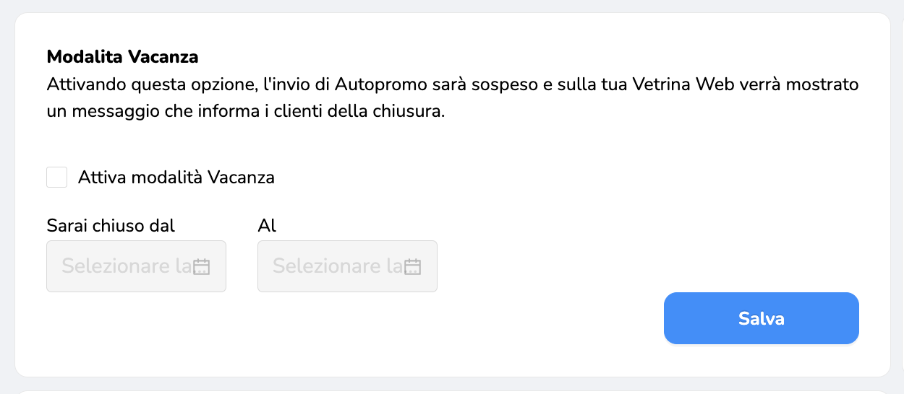

Attivando la modalità vacanza, i clienti vedranno la scritta “Chiuso fino al” nella pagina del tuo locale (via web o App) e non verranno inviate Promozioni Automatiche durante quel periodo. 

Ecco come attivarla:

1\. Entra nel Gestionale Unipiazza vai in "Impostazioni"

2\. Premi sul bottone “Attiva Modalità Vacanza”.

3\. Imposta la data di inizio e di fine
