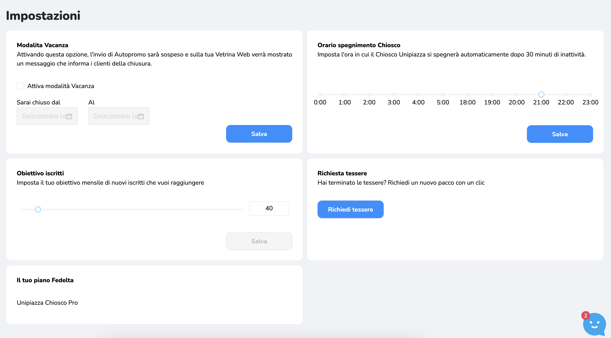

La sezione [Impostazioni](https://partner.unipiazza.it/impostazioni) del tuo pannello di controllo Unipiazza è il luogo dove puoi personalizzare e configurare diverse opzioni per ottimizzare la gestione della tua attività. Ecco una panoramica dettagliata di cosa puoi fare in questa sezione:

1.  **Modalità Vacanza:** Se prevedi di chiudere per ferie o per qualche giorno, attiva questa modalità per informare i tuoi clienti. Un messaggio comparirà sulla tua vetrina web e nell'app Unipiazza, così i tuoi clienti sapranno quando tornerai e non verranno inviate Autopromo durante questo periodo.
    
2.  **Orario Spegnimento Chiosco:** Scegli l'orario in cui vuoi che il Chiosco si spenga da solo. 
    
3.  **Obiettivo Iscritti:** Imposta l’obiettivo mensile di nuovi iscritti in modo da motivare tutto il tuo team a raggiungerlo. L’obiettivo verrà visualizzato sul tuo Smartphone Unipiazza e nella sezione riepilogo del gestionale.
    
4.  **Richiesta Tessere:** Se sei a corto di tessere fisiche per i tuoi clienti, qui puoi richiederne altre che ti verranno spedite nel giro di qualche giorno direttamente presso la tua attività. Qualora avessi superato il limite di tessere previste dal tuo pacchetto, verrai contattato da un membro del team Unipiazza. 
    
5.  **Il Tuo Piano Fedeltà:** Qui puoi visualizzare il pacchetto attuale che hai scelto.
