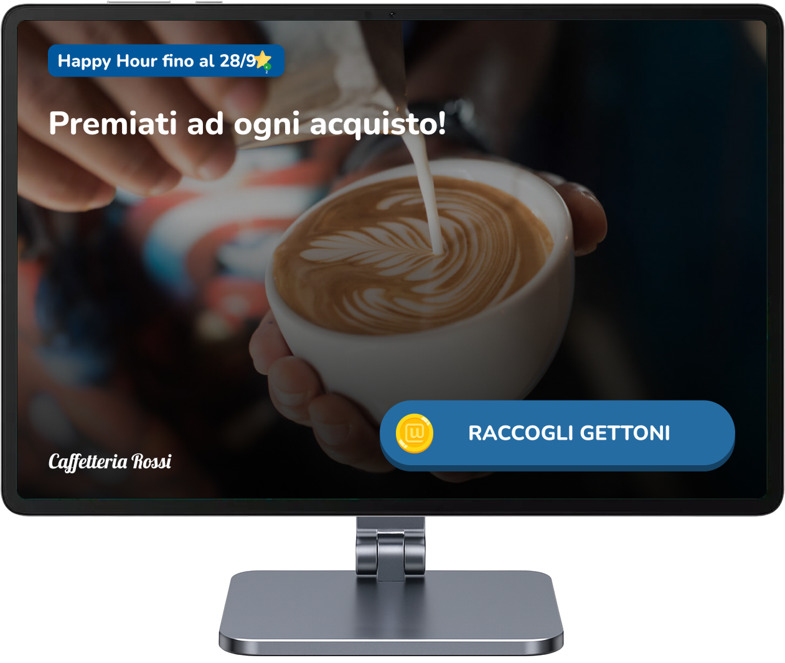

Quando carichi immagini su Unipiazza, è essenziale utilizzare le dimensioni corrette per garantire una visualizzazione ottimale su tutte le piattaforme. Ecco una guida rapida alle risoluzioni delle immagini consigliate per le diverse funzioni di Unipiazza.

 

**Immagini Vetrina (Web & App)**

\- Formato: 16:10

\- Dimensione minima: 480x300 pixel

\- Dimensione consigliata: 1280x800 pixel

<table style="min-width: 25px;"><colgroup><col style="min-width: 25px;"></colgroup><tbody><tr><td colspan="1" rowspan="1">
<strong>💡Nota:</strong> Come vedi nell’immagine qui sopra, su App Android e iOS, la parte superiore e inferiore delle immagini viene leggermente tagliata (il formato visualizzato è 21:9).&nbsp;
</td></tr></tbody></table>

**Immagini Cover Chiosco**

\- Formato: 16:10

\- Dimensione minima: 480x300 pixel

\- Dimensione consigliata: 1920x1200 pixel

La risoluzione **1920×1200 px** è quella specifica del tablet **Honor Pad X8a**, fornito nei **Kit Unipiazza Full**.

Se utilizzi altri tablet, la risoluzione potrebbe variare in base al modello, ma consigliamo sempre di caricare immagini in **alta risoluzione** per evitare perdita di qualità.

 📅 **Attenzione:** se hai acquistato il servizio **prima di settembre 2025**, il tuo Chiosco potrebbe utilizzare un tablet con risoluzione massima **1280×800 px**, quindi puoi mantenere quella come riferimento.

<table style="min-width: 25px;"><colgroup><col style="min-width: 25px;"></colgroup><tbody><tr><td colspan="1" rowspan="1">
<strong>💡Nota:</strong> È da tenere presente che sopra all’immagine cover compariranno degli elementi dell’interfaccia che copriranno alcune zone dell’immagine. Qui sopra vedi un esempio.
</td></tr></tbody></table>

**Autopromo Campagne**

\- Formato: Libero, ma si consiglia 16:10 per una migliore leggibilità

\- Dimensione minima: 300x300 pixel

\- Dimensione consigliata: 1280x800 pixel o superiore

<table style="min-width: 25px;"><colgroup><col style="min-width: 25px;"></colgroup><tbody><tr><td colspan="1" rowspan="1">
<strong>💡Nota:</strong> Le campagne vengono mostrate via Email, RCS e Notifiche App.
</td></tr></tbody></table>

**Campagne Generiche, Evento o Promo**

\- Formato: Libero, ma si consiglia 16:10 per una migliore leggibilità

\- Dimensione minima: 300x300 pixel

\- Dimensione consigliata: 1280x800 pixel o superiore

<table style="min-width: 25px;"><colgroup><col style="min-width: 25px;"></colgroup><tbody><tr><td colspan="1" rowspan="1">
<strong>💡Nota:</strong> Le campagne vengono mostrate via Email, RCS, Notifiche App, Chiosco Tablet e Vetrina Web.
</td></tr></tbody></table>

Seguendo queste linee guida, garantirai che le tue immagini siano sempre visualizzate correttamente, migliorando l'esperienza utente dei tuoi clienti sia sul web che sulle app. 

 
