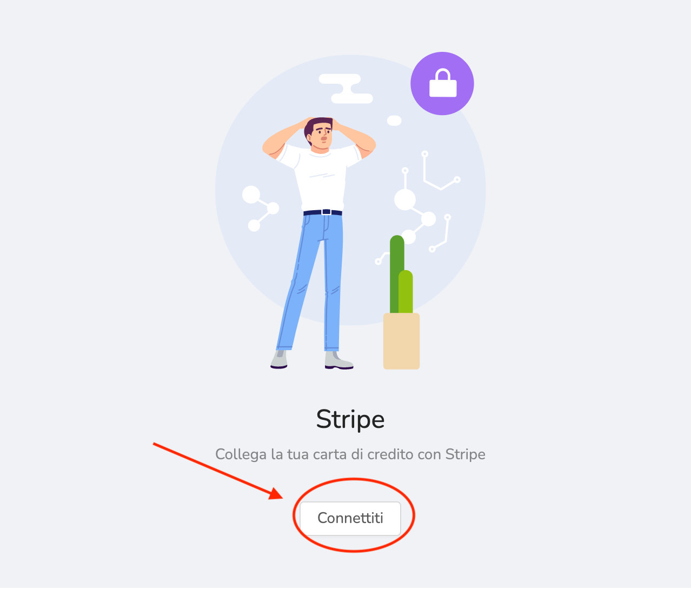

Stripe è un **software sicuro** usato da milioni di aziende che ti permette di accettare  pagamenti e gestire l'attività online. Stripe dà la possibilità di pagare tramite carta di credito e prepagate (Poste Pay inclusa nel circuito Visa).

 

#### 🔗Come collegare Stripe

Per collegare Stripe, una volta ricevuto il nostro link, clicca su "**connettiti**",  si aprirà una schermata da completare con i vostri dati. 🔽Qui sotto, ti spiego come completare i passaggi. 🔽

-   **SITO WEB AZIENDALE:** Se non avete un sito web, potete inserite il link della pagine eShop di Unipiazza.
    
-   **DESCRIZIONE AZIENDA:** selezionate il settore commerciale a cui appartiene la vostra attività. Nella descrizione è sufficiente inserire poi la specifica, _ad esempio: SETTORE - servizi per la persona/ centri salute e benessere, DESCRIZIONE - centro estetico;_
    
-   **NEL CASO FOSTE UNA SRL:** è necessario inserire il numero RI/REA. Se non ne siete in possesso al momento, inserire il codice fiscale;
    
-   **INDIRIZZO AZIENDA:** inserire l’indirizzo esclusivamente della sede legale;
    
-   **IMPOSTA PASSWORD:** la password deve contenere una maiuscola, un numero ed un carattere speciale.
    

⚠ _Hai già un account Stripe?_ _Clicca su_ "**Crea account**" _ed in alto a destra su_ "**Accedi**".

#### 💶Qual è il costo di Stripe?

Stripe è un software esterno a Unipiazza, **Unipiazza** **non prende provvigioni** dalle vostre transazioni, il costo delle transazioni tramite Stripe è il seguente:

0.25 cent + 1,4% a transazione. ⏩ ESEMPIO: su 100€  25 cent + 1,40€

 

 
