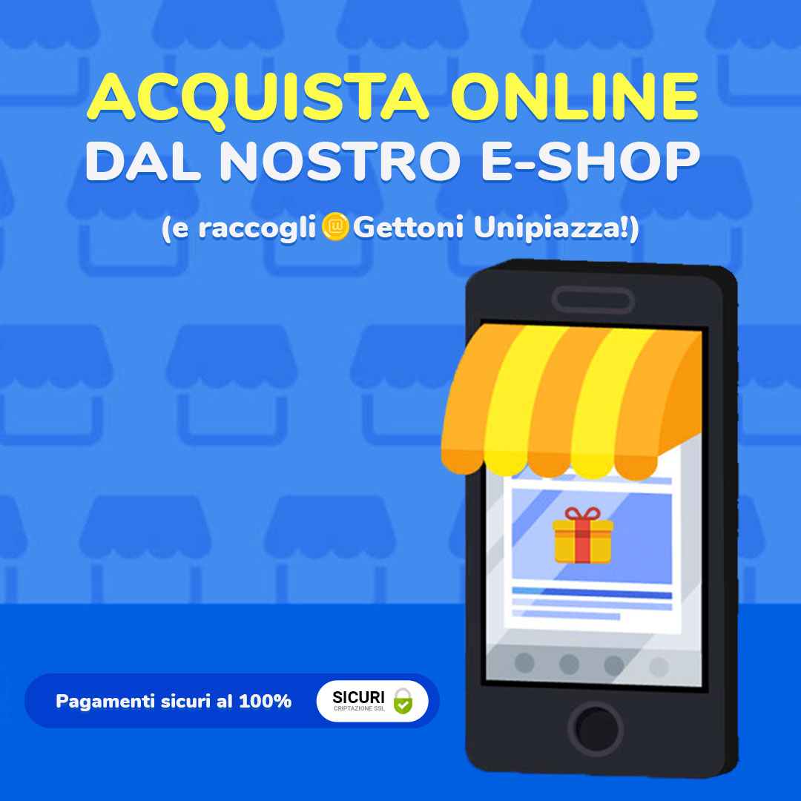

Ciao Gestore,

 

hai aperto un eShop ma non hai ancora avuto degli ordini? Ti sei ricordato di comunicare ai tuoi clienti che possono comprare i tuoi prodotti con un click? Comunicare le novità della tua attività è fondamentale altrimenti tutti gli sforzi fatti per migliorare il servizio saranno inutili! Spiegagli cosa è cambiato e cosa possono trovare di nuovo per stimolare la curiosità del tuo cliente.

Ecco per te alcuni esempi pratici per far sapere a tutti che hai un eShop.

 

## Comunicazione in negozio ✍🏼

Immaginate di avere un cliente in negozio e che dopo averlo coccolato, quest’ultimo decide di acquistare quello che gli avete consigliato. Bene, ora è il momento giusto! Prima di salutarlo ricordargli che ti può trovare su Internet scrivendo:

 

_“_**_nomedeltuolocale.unipiazza.it_**_”_    

⚠ _Ricordati che quando scrivi un link i caratteri speciali e gli spazi NON vanno inseriti_  (es. "Bar Rossi" diventa "barrossi.unipiazza.it") ⚠

 

"Verba volant scripta manent" dicevano in latino. Se hai paura che la spiegazione orale non basti, lasciagli un piccolo bigliettino con il link.

 

## Comunicazione Whatsapp 📣

Se sei solito comunicare con i tuoi clienti tramite Whatsapp trova un momento per inviargli un messaggio veloce!

Condividi il link del tuo eShop Unipiazza e aggiungi un testo carino, personalizzato con qualche emoji: 

 

“_Da oggi puoi trovare i nostri prodotti online sul nostro eShop! Registrati, acquista e raccogli gettoni per ottenere fantastici premi._”

 

_“Vuoi ordinare i tuoi prodotti online e ritirarli in negozio quando vuoi tu? Prenota online, ritira in negozio e raccogli gettoni per ottenere altri fantastici premi!”_

 

 

## Comunicazione su Unipiazza Partner 🚀

In questo caso ti basteranno 5 minuti del tuo tempo e i tuoi clienti sapranno subito di te!

Ti basterà entrare nell'App Unipiazza e creare una "campagna marketing". Facile, veloce e intuitivo! Ti basterà usare una delle immagini che ora ti presentiamo e aggiungere una descrizione.

 

 

 

Ecco un piccolo video per ricapitolare i passaggi da fare. Segui le istruzioni, ti bastano 2 minuti!

 

<iframe src="https://www.youtube.com/embed/UxKpH6w1CT0?&amp;wmode=opaque" frameborder="0" allowfullscreen="true"></iframe>

## Comunicazione Social 📲

Hai una pagina Facebook e Instagram sfruttali! Ti bastano un’immagine carina e una piccola frase accattivante. 

 

📎 **Facebook**

Segui alcuni semplici step:

 

1-Scarica una di queste immagini che trovi in "Comunicazione su Unipiazza" o scegline una che ti piace.

 

2-Segli una descrizione. Puoi utilizzare una di quelle che trovi qui sotto o scriverne te una.

 

“_Da oggi ti basterà acquistare i tuoi prodotti preferiti con un semplice click! Registrati, acquista e raccogli gettoni per ottenere fantastici premi. Visita: nomedellocale.unipiazza.it_ ”

 

“_Vuoi ordinare i tuoi prodotti online e ritirarli in negozio quando vuoi tu? Prenota online, ritira in negozio e raccogli gettoni per ottenere altri fantastici premi! Visita: nomedellocale.unipiazza.it_”

 

“_Da oggi puoi acquistare comodamente online alcuni nostri prodotti e farteli spedire direttamente a casa! Eccome come fare:_ 

1️⃣ _Premi sul bottone arancione qui sotto_

2️⃣ _Aggiungi al carrello i prodotti che preferisci_

3️⃣ _Accedi con il tuo profilo Unipiazza_

4️⃣_Segui le istruzioni e concludi l’acquisto!_

_Nel giro di qualche giorno i prodotti arriveranno a casa tua e in più potrai goderti i gettoni che hai raccolto per ritirare splendidi premi da noi!_ 🎁”

 

 

📎 **Instagram**

Instagram è leggermente diverso rispetto a Facebook per questo i passaggi da seguire sono leggermente diversi. 

Ora ti spiego passo passo cosa fare. 

 

1-Aggiungo il link del tuo eShop nella Bio.

 

**Come prima cosa clicca su Modifica profilo**

 

 

**Scrivi "_nomedellocale.unipiazza.it_" nella sezione Sito web**

 

 

**Ricordati di SALVARE!**

 

2-Scegli questa foto o scegline una che ti piace

 

 

3-Scegli una descrizione

“_Da oggi ti basterà acquistare i tuoi prodotti preferiti con un semplice click! Registrati, acquista e raccogli gettoni per ottenere fantastici premi_

_Link in Bio_ 🔼”

 

“_Vuoi ordinare i tuoi prodotti online e ritirarli in negozio senza quando vuoi tu? Prenota online, ritira in negozio e raccogli gettoni per ottenere altri fantastici premi!_

_Link in Bio_ 🔼 ”

 

4-Ricordati degli Hashtag

Gli Hashtag su Instagram sono molto importanti perché ti permettono di avere una maggiore visibilità. Ne bastano 5 o 6 e tra questi te ne suggeriamo alcuni da scegliere in base alla tua attività:

**#lovelocal #unipiazza #qualità #madeinitaly #eshop #prodottiartigianali #prodottikm0 #asporto #venditadiretta #acquistaonline**

 

