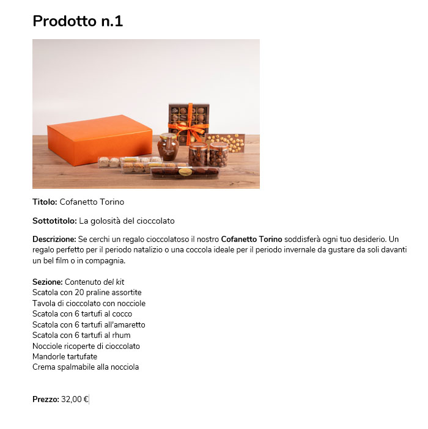

Ciao Gestore, 

 

Le foto dei prodotti sono pronte, ora ti servono le descrizioni! Organizzare il materiale prima di inserirlo nell’eShop🛒 ti permetterà di essere più veloce nella fase di caricamento dei prodotti. 

 

Pronto per iniziare?! Come prima cosa, devi decidere quali dettagli inserire nella “Descrizione”  e quali mettere in evidenza nelle varie “Sezioni”.

Apri un foglio Word 📄 sul tuo computer e inizia a scrivere per ogni prodotto:

 

-   **Titolo**;
    
-   **sottotitolo** (solo se necessario);
    
-   **descrizione**: in questo caso vige la regola del “**less is more**”, cioè poche informazioni, spiegate in maniera semplice, ma importanti. 📍 I step: Prepara una breve introduzione (max 2 o 3 frasi) “romanzata” in cui spieghi com'è fatto il prodotto, come è stato lavorato e cerca di incuriosire il tuo potenziale cliente invitandolo a provarlo. Ecco alcuni esempi:  _“Un dolce trionfo del cioccolato. Una base di pan di spagna al cioccolato, un corpo spumoso al cioccolato al latte con un cuore cremoso al cioccolato bianco. In chiusura, una colata a specchio di glassa cioccolato fondente. Il successo è assicurato!”_  _“Cerchi un gioco di carte collaborativo ispirato alle Escape Room? Unlock Vi consente di vivere questa esperienza a casa vostra, seduti a un tavolo.”_  _“Le bombe da bagno di Bomb Cosmetics sono interamente realizzate a mano, utilizzando le materie prime migliori e gli oli essenziali più puri. Lanciale nella vasca per un momento di relax, o un bagno diverso dal solito. Frizzanti, colorate e profumatissime, ti renderanno sfavillante e pieno di gioia.”_  📍 II step: prepara e ordina i **dettagli tecnici** dei prodotti da inserire nelle sezioni. Ai consumatori piace avere informazioni complete per poter fare dei confronti con altri articoli in vendita o semplicemente perché cercano qualcosa di specifico. Forza, facciamo un ultimo sforzo!  👗 Sei un negozio di abbigliamento, calzature o borse 👗  **Marca:** Gucci  **Colori disponibili:** Bianco, Rosso, Verde **Taglie disponibili:** XS-L  **Dimensioni e capienza:**  40x30x15, 15L **Tessuto:** viscosa, lurex, jeans, cotone **Vestibilità:** aderente, tubino, svasato, morbido **Altri dettagli:** tracolla in pelle, scollo a V, spalline imbottite **Prezzo:** 120,00 €  💅🏼Se sei un negozio che lavora nel settore beauty 💅🏼  **Marca:** Loreal  **Contenuto del kit:** detergente per il viso, una crema idratante, siero viso **Ingredienti principali:** Bava di lumaca, acido Jaluronico ecc. **Aroma:** Vaniglia **Colori disponibili:** Rosa, Azzurro  **Quantità:** 150 ml **Prezzo:** 20 €  🍝 Se fai parte della ristorazione 🍝  **Contenuto:** 1 panettone, 1 pandoro, 2 confezione di mandorle tartufate **Ingredienti principali:** uova, latte, farina, cioccolato **Peso:** 500 gr **Come conservarlo:** in un luogo asciutto **Lista allergeni:** “Allega un PDF” **Suggerimenti:** come gustare il prodotto: Aggiungi un po’ di crema spalmabile sul nostro panettone per rendere ancora più goloso il tuo dessert **Prezzo:** 30 €  🎈 Se hai un negozio che vende oggettistica, giochi e altro 🎈  **Autore:** Antoine Bauza **Editore:** Repos Production **Anno:** 2010 **Età:** 10+ **Giocatori:** 3-7 **Durata:** 30 minuti  **Contenuto:** Set Cucina **Peso:** 150 gr **Dimensioni:** 15x20x10 **Colori disponibili:** Verde, Arancione **Modelli disponibili:** Acciaio, Legno  
    

⚠ Cerca di riportare le stesse informazioni per tutti i prodotti ed **elimina** **le voci che non usi** o non trovi informazioni (es. se manca il peso specifico di tre quarti dei prodotti, elimina la voce anche sugli altri) ⚠

 

Scrivere le informazioni su un foglio Word ti permette di ordinare le informazioni e correggere gli errori grammaticali. Una volta terminato l'elenco, ricordati di salvare il materiale. Quando inserirai i prodotti nell’eShop🛒 ti basterà fare copia-incolla e il gioco è fatto! 

Ecco come dovrebbe essere il risultato finale: 

 

 
