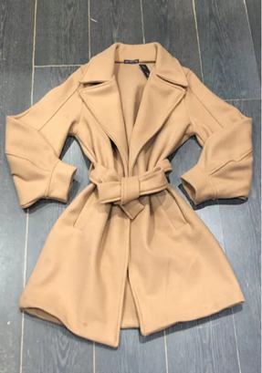
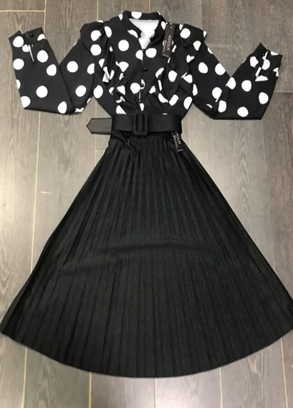

**📸 Suggerimenti per una foto perfetta!** **📸**

 

Ciao Gestore,

vogliamo rendere il tuo **eShop** migliore di tutti gli altri, ecco per te alcuni suggerimenti per una foto perfetta! 😉

 

-   Controllo luci e le ombre
-   Assicurati che la superficie abbia **un solo colore** (es. piano bianco, pavimento in legno)
-   Posizionare il prodotto **al centro**
-   Inquadra il prodotto (vedi immagini per capire qual è  l'inquadratura ideale per te!)
-   Assicurati che **non si veda sfuocato** (in quel caso ti basterà toccare con il dito il punto che vuoi inquadrare e la fotocamera si regolerà da sola).
-   Scatta la tua foto!

 

❕ ATTENZIONE ❕

Fotografa **un solo prodotto** alla volta e assicurati che sia **al centro** dell'immagine.

**NO** etichetta o prezzo in vista. Ai dettagli ci pensiamo noi! 😃(es. comunica marca, prezzo, colori e altre caratteristiche a parte)

 

 

Guarda alcuni esempi fotografici da cui prendere spunto…

 

\- ABBIGLIAMENTO ▶ inquadratura **dall'alto**.

 

 

\- BEAUTY ▶ inquadratura **verticale** parallela o **leggermente inclinata** rispetto al prodotto.

 

\- OGGETTISTICA ▶ inquadratura **verticale,** **dall'alto**  o  **3/4 rispetto al prodotto**.

 

![Philos 9960 - Set di Giochi da Tavolo, 10 Combinazioni di Giochi [Importato  dalla Germania]: Amazon.it: Giochi e giocattoli](../../assets/13-eshop/6866_81m5tOI9C-L._AC_SX355_.jpg)

 

 

 
